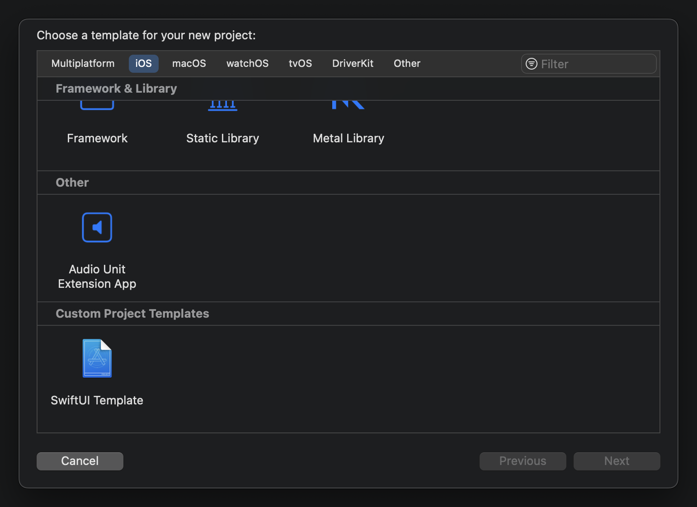

# Custom-Xcode-Project-Template

<section align="center">
  
  &nbsp;&nbsp;&nbsp;&nbsp;&nbsp;
  
  &nbsp;&nbsp;&nbsp;&nbsp;&nbsp;

</section>

### Overview
A custom Xcode project template used to dynamically generate a simple hierarchical SwiftUI project.

### Use Case:

Custom Xcode project templates leverage the power of dynamic file creation across an entire project. Where code snippets can be used to insert generic code, custom Xcode file templates allow the dynamic injection of boilerplate code within known bounds, with custom project templates doing the same over larger projects. 

By typing a *struct*'s name once at the start of a project, files can be dynamically populated with the project ready to run using relevant nomenclature.  

Further, custom project templates facilitate the creation of document directory hierarchies, reducing the time needed to structure files into pre-planned layouts.

    
Contents:

    <ul class="overview-section">
        <li><h3><a href="#future-plans">Future Plans</a></h3></li>
        <li><h3><a href="#current-difficulties">Current Difficulties</a></h3></li>
        <li><h3><a href="#past-problems">Past Problems</a></h3></li>
        <li><h3><a href="#screenshots">Screenshots</a></h3></li>
        <li><h3><a href="#licensing">Licensing</a></h3></li>
    </ul>

&nbsp;

# Project Progression

## Future Plans:

#### <ins>Template Inheritance & Modularisation</ins>

The modularisation of templates will facilitate updating templates and enable the creation of larger more complex templates.

#### <ins>Power of Templates??</ins>

What else can be prefigured or dynamically generated by templates??

## Current Difficulties:

#### <ins>Xcode Crashes</ins>

If a template is configured incorrectly (e.g. when a file is listed under Definitions but not Nodes, or if a filepath is wrong) Xcode will not flag the issue and will simply crash. This can make debugging tricky and tiresome, especially for larger templates, modularisation will help here, along with continuous and periodic backups and testing. 

## Past Problems:

#### <ins>Missing Templates</ins>

Templates may occasionally not appear in the Xcode project start-up menu, important things to check within the **.plsit** is the template Identifier is unique, Concrete is set to YES. Also that the custom template file is saved in the correct directory.

<!-- # Screenshots -->

### Licensing

There is [no license](https://choosealicense.com/no-permission/) associated with this project other than usual GitHub [Terms of Service](https://docs.github.com/en/site-policy/github-terms/github-terms-of-service), however, please be mindful and acknowledge me as the original author if you use significant or distinct portions of this code.
