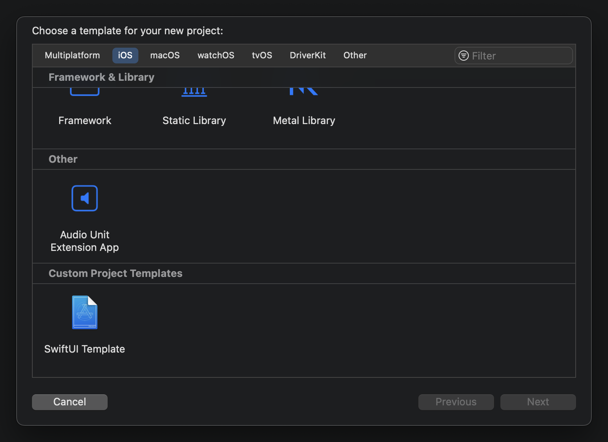
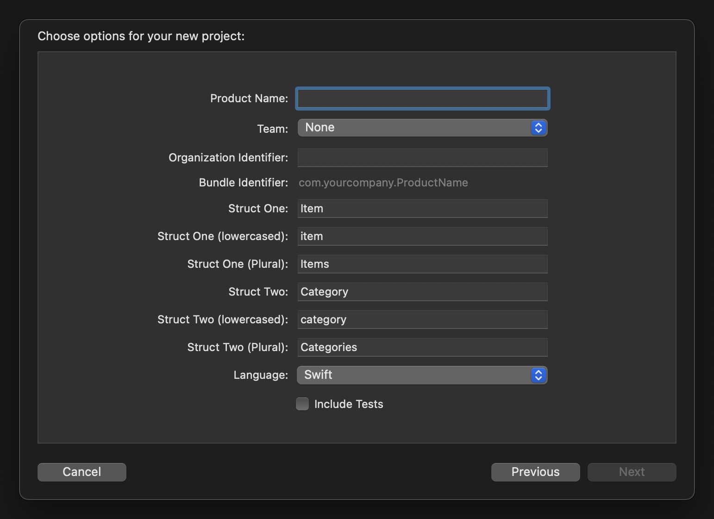

# Custom-Xcode-Project-Template
A custom Xcode template used to dynamically generate a simple SwiftUI project.

### Overview:

  &nbsp;&nbsp;&nbsp;&nbsp;&nbsp;
&nbsp;&nbsp;&nbsp;&nbsp;&nbsp;
&nbsp;&nbsp;&nbsp;&nbsp;&nbsp;
  <!-- &nbsp;&nbsp;&nbsp;&nbsp;&nbsp; -->

  

